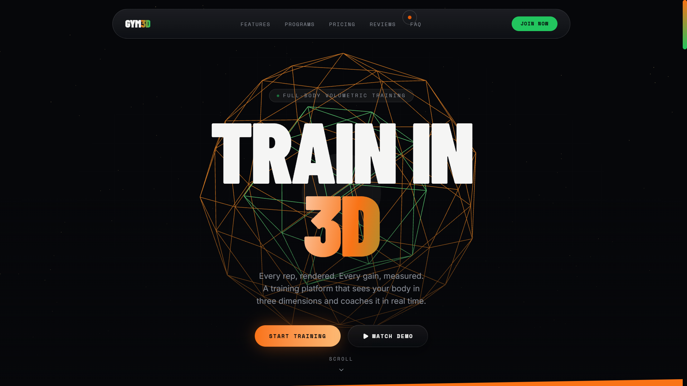
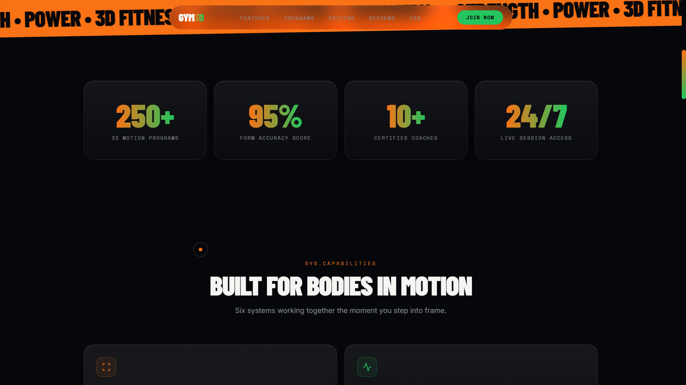
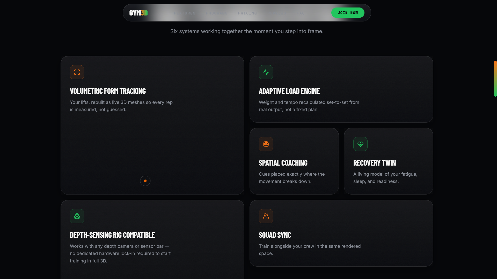
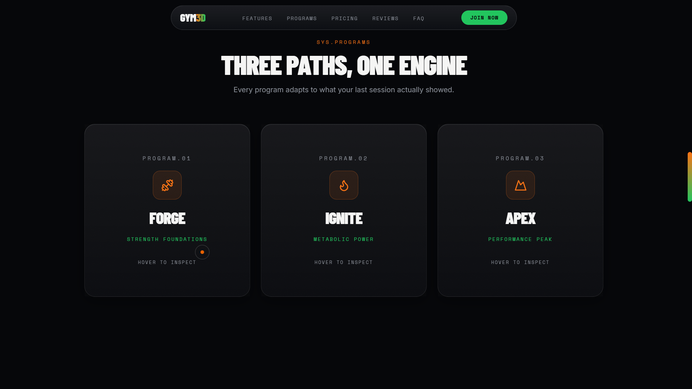
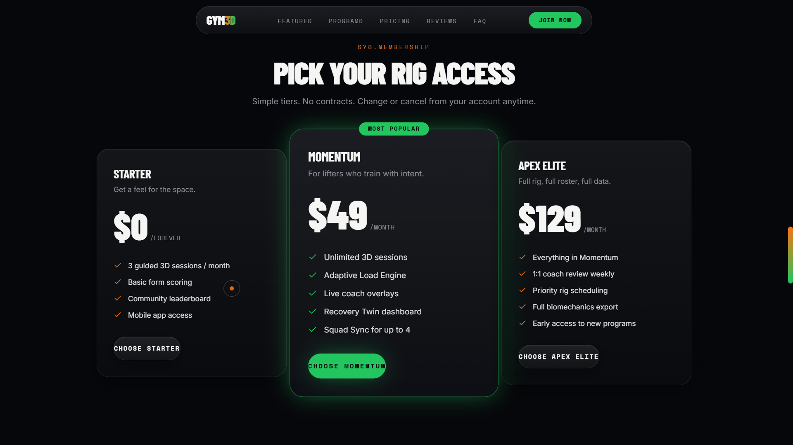
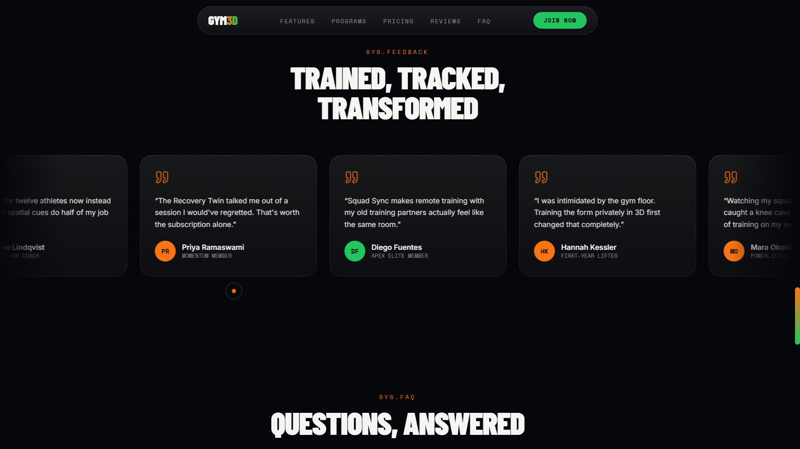
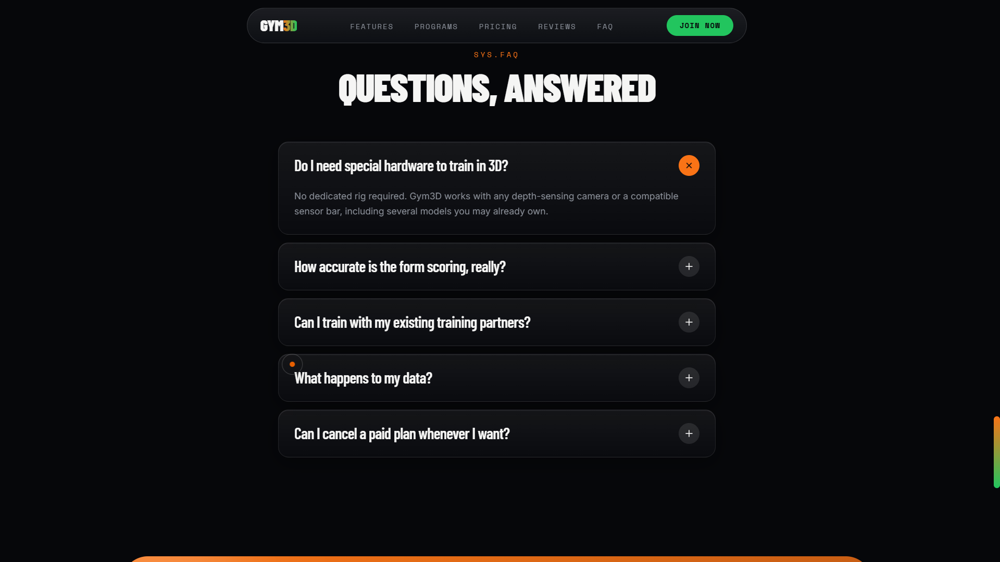
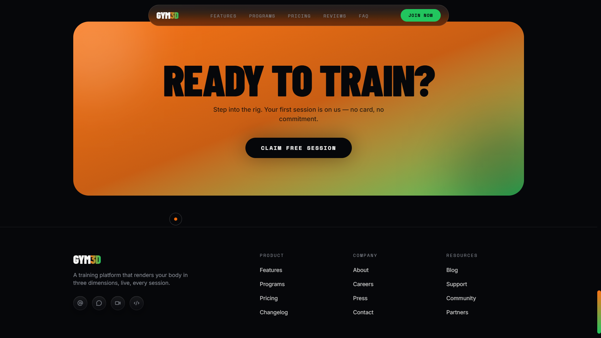

# 🏋️ Gym3D — 3D Motion-Tracking Fitness Platform UI

> **A cutting-edge UI showcase for a fictional 3D motion-capture fitness platform. No backend. Pure visual design.**



## 🎯 Overview

Gym3D is a single-page, front-end-only concept website that showcases what a 2026-era AI-powered fitness platform could look like. The design features a full 3D hero scene, glassmorphism, smooth animations, and a dark, energetic aesthetic.

## ✨ Features

- 🎨 **3D Hero Scene** — React Three Fiber with animated particles, rotating geometric meshes, and mouse parallax
- 🪟 **Glassmorphism UI** — Frosted glass cards, navbars, and overlays throughout
- 🎬 **Smooth Animations** — Framer Motion transitions, reveals, flip cards, and scroll effects
- 🖱️ **Custom Cursor** — Desktop-only custom pointer with blend mode
- 🧲 **Magnetic Buttons** — Interactive buttons that pull toward the cursor
- 📊 **Animated Stats** — Scroll-triggered number counters
- 🎪 **Marquee Band** — Infinite scrolling fitness phrases
- 🃏 **Bento Grid** — Asymmetric feature layout with 3D tilt cards
- 🔄 **Flip Cards** — Program cards with hover flip animations
- 📱 **Fully Responsive** — Mobile-first design from 375px to 4K

## 🖼️ Screenshots

| Section | Preview |
|---------|---------|
| **Hero** |  |
| **Marquee + Stats** |  |
| **Features (Bento)** |  |
| **Programs** |  |
| **Pricing** |  |
| **Testimonials** |  |
| **FAQ** |  |
| **CTA + Footer** |  |

## 🛠️ Tech Stack

| Technology | Purpose |
|------------|---------|
| **React 19** | UI framework |
| **TypeScript** | Type safety |
| **Vite 8** | Build tool |
| **Tailwind CSS v4** | Styling |
| **Framer Motion** | Animations & transitions |
| **React Three Fiber** | 3D rendering |
| **Drei** | Three.js helpers |
| **Three.js** | WebGL |
| **Lenis** | Smooth scrolling |
| **Lucide React** | Icons |
| **oxlint** | Linting |

## 🚀 Getting Started

### Prerequisites

- Node.js 18+ (recommended: Node 20+)
- npm or yarn

### Installation

```bash
# Clone the repository
git clone https://github.com/YOUR_USERNAME/gym3d-ui.git

# Navigate to project
cd gym3d-ui

# Install dependencies
npm install

# Start development server
npm run dev
```

Visit `http://localhost:5173` to see the site.

### Production Build

```bash
# Build for production
npm run build

# Preview production build
npm run preview
```

### Linting

```bash
npm run lint
```

## 📁 Project Structure

```
gym3d/
├── public/
│   ├── favicon.svg
│   └── icons.svg
├── screenshots/
│   ├── 01-hero.png
│   ├── 02-marquee-stats.png
│   ├── 03-features.png
│   ├── 04-programs.png
│   ├── 05-pricing.png
│   ├── 06-testimonials.png
│   ├── 07-faq.png
│   └── 08-cta-footer.png
├── src/
│   ├── assets/
│   │   └── hero.png
│   ├── components/
│   │   ├── Bento.tsx          # Feature bento grid
│   │   ├── CTA.tsx            # Final call-to-action
│   │   ├── CustomCursor.tsx   # Custom desktop cursor
│   │   ├── FAQ.tsx            # Accordion section
│   │   ├── Footer.tsx         # Site footer
│   │   ├── Hero.tsx           # Hero section with 3D
│   │   ├── HeroScene.tsx      # Three.js 3D scene
│   │   ├── Loader.tsx         # Initial loading animation
│   │   ├── MagneticButton.tsx # Magnetic hover effect
│   │   ├── Marquee.tsx        # Scrolling text band
│   │   ├── Navbar.tsx         # Navigation
│   │   ├── Pricing.tsx        # Pricing tiers
│   │   ├── Programs.tsx       # Program cards
│   │   ├── SectionHeading.tsx # Reusable heading
│   │   ├── Stats.tsx          # Animated counters
│   │   ├── Testimonials.tsx   # Reviews carousel
│   │   └── TiltCard.tsx       # 3D tilt effect
│   ├── data/
│   │   └── content.ts         # All hardcoded content
│   ├── hooks/
│   │   └── useLenis.ts        # Smooth scroll hook
│   ├── App.tsx                # Root component
│   ├── index.css              # Tailwind + design tokens
│   └── main.tsx               # Entry point
├── .gitignore
├── .oxlintrc.json
├── index.html
├── package.json
├── tsconfig.json
└── vite.config.ts
```

## 🎨 Design System

### Colors

| Role | Hex | Usage |
|------|-----|-------|
| Background | `#06070a` | Main dark background |
| Surface | `#0b0d12` | Cards, panels |
| Orange | `#f97316` | Primary accent |
| Green | `#22c55e` | Secondary accent |
| Text | `#f5f5f4` | Main text |
| Muted | `#8a8f98` | Secondary text |

### Typography

| Font | Usage |
|------|-------|
| **Barlow Condensed** | Display headlines |
| **Inter** | Body text |
| **Space Mono** | Labels, telemetry text |

### Key Effects

- **Glassmorphism** — `backdrop-blur` with semi-transparent backgrounds
- **Gradient Text** — Orange-to-green gradients
- **3D Tilt** — Mouse-tracking perspective transforms
- **Glow Effects** — Orange and green box-shadows
- **Noise Texture** — SVG noise overlay for depth
- **Grid Overlay** — Subtle grid pattern backgrounds

## 📱 Responsive Breakpoints

| Breakpoint | Width | Target |
|------------|-------|--------|
| Mobile | 375px+ | Default |
| Tablet | 768px+ | `md:` |
| Desktop | 1024px+ | `lg:` |
| Wide | 1440px+ | `xl:` |
| Ultra-wide | 1920px+ | `2xl:` |

## ♿ Accessibility

- ✅ Respects `prefers-reduced-motion`
- ✅ Semantic HTML structure
- ✅ ARIA labels on interactive elements
- ✅ Keyboard navigable
- ✅ Color contrast ≥ 4.5:1
- ✅ Focus states visible

## 🧪 Browser Support

- Chrome / Edge (latest)
- Firefox (latest)
- Safari (latest)
- Mobile browsers (iOS Safari, Chrome Android)

## 📄 License

MIT License — feel free to use this for your own projects.

Copyright (c) 2026 Gym3D

## 🙏 Credits

- Fonts: [Barlow Condensed](https://fonts.google.com/specimen/Barlow+Condensed), [Inter](https://fonts.google.com/specimen/Inter), [Space Mono](https://fonts.google.com/specimen/Space+Mono)
- Icons: [Lucide](https://lucide.dev)
- 3D: [Three.js](https://threejs.org), [React Three Fiber](https://docs.pmnd.rs/react-three-fiber)
- Animations: [Framer Motion](https://www.framer.com/motion/)
- Smooth Scroll: [Lenis](https://github.com/darkroomengineering/lenis)

## ⚠️ Disclaimer

This is a **UI showcase** — no actual backend, authentication, payment processing, or real functionality. All data is mocked/hardcoded. Built for portfolio and design demonstration purposes.

---

**Made with 💪 by Sharat S Unnithan **
